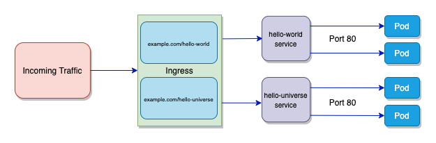

- All pods are allow to communicate with other pods in cluster through IP addresses and services . 
- Network Policies : It is an object 

An ingress controller is a specialized proxy and load balancer that runs inside a Kubernetes cluster to manage external (HTTP/HTTPS) traffic. We need them to provide a single public entry point, enable smart path- and host-based routing, and handle SSL/TLS termination without paying for multiple cloud load balancers.What is an Ingress Controller?Acts as a smart reverse proxy sitting at the edge of a cluster.Reads and implements the routing rules defined in Kubernetes Ingress resource objects.Translates API rules into live configurations for engines like NGINX, Envoy, or Traefik.Why Do We Need Them?Single Entry Point: Instead of making a separate costly cloud load balancer for every single microservice, all traffic goes through one primary address.Host and Path Routing: Directs traffic based on URL paths (e.g., /shop vs /blog) or domain names (e.g., shop.com vs blog.com).TLS/SSL Termination: Secures web traffic by handling HTTPS certificates centrally at the cluster boundary.Traffic Management: Supports advanced features like load balancing, health checks, and canary traffic splitting.For a quick visual breakdown of what an ingress controller is and how it functions:

------------
What is SSL and TSL ?

SSL (Secure Sockets Layer) and TLS (Transport Layer Security) are cryptographic protocols that encrypt data sent over the internet to prevent hackers from reading or modifying it. TLS is the modern, secure successor to SSL, though people often use the term "SSL" to refer to both.

The Core DifferenceSSL: Created by Netscape in the 1990s. It is completely obsolete and insecure.TLS: The modern upgrade to SSL. It is highly secure and actively used today.The Name: The industry still uses the term "SSL" or "SSL/TLS" out of habit.

Why We Need ThemEncryption: Scrambles data sent between a browser and a server (e.g., credit card numbers, passwords) so attackers cannot intercept it.Authentication: Verifies that the website you are connecting to is legitimate and not a fake site.Data Integrity: Ensures that data cannot be altered or corrupted during transit without being detected.Browser Trust: Enables the https:// prefix and the padlock icon in the browser address bar

------------------
What mean by term "Ingress Resource rules"?

An Ingress resource rule is a specific routing configuration defined inside a Kubernetes Ingress object that tells the Ingress controller exactly where to send incoming web traffic based on the URL path or domain name. 
Think of the Ingress Controller as a traffic cop, and the Ingress resource rules as the rulebook that the cop reads to direct cars to the right destination.

## The Anatomy of an Ingress Rule
An Ingress resource rule typically consists of three main components: 

* Host (Domain): Specifies the domain name the rule applies to (e.g., ://example.com). If left blank, the rule applies to all inbound HTTP traffic.
* Path: Specifies the URL path suffix (e.g., /products or /login) to match against incoming traffic.
* Backend: Specifies the exact Kubernetes cluster Service and target port where matching traffic must be forwarded.

## Types of Routing Rules## 1. Path-Based Routing
Directs traffic to different backend services using the same domain name but different URL paths. 

* ://example.com → routes to Video-Service
* ://example.com → routes to Image-Service

## 2. Host-Based Routing (Virtual Hosting)
Directs traffic to different backend services based on the specific domain or subdomain requested. 

* ://example.com → routes to E-commerce-Service
* ://example.com → routes to WordPress-Service

## What a Rule Looks Like (YAML Example)

spec:
  rules:
  - host: ://example.com            # 1. The Host Rule
    http:
      paths:
      - path: /analytics               # 2. The Path Rule
        pathType: Prefix
        backend:
          service:
            name: analytics-service    # 3. The Backend Destination
            port:
              number: 80

---------------------------------------------------

Format - kubectl create ingress <ingress-name> --rule="host/path=service:port"

Example - kubectl create ingress ingress-test --rule="wear.my-online-store.com/wear*=wear-service:80"

# INGRESS NETWORKING - 1 

