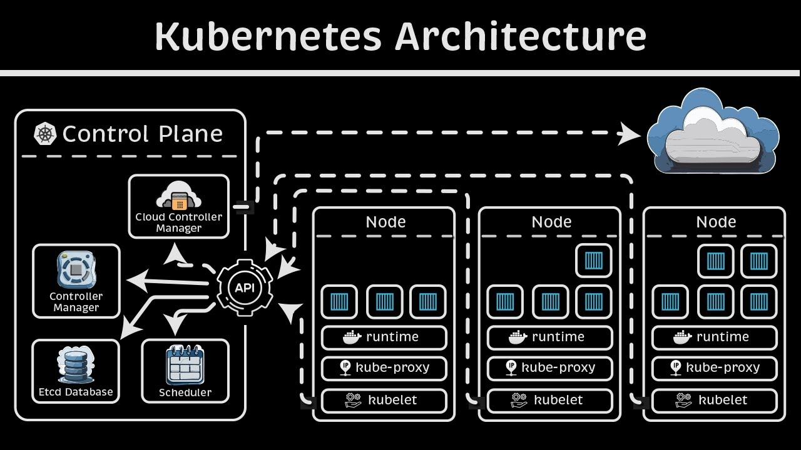
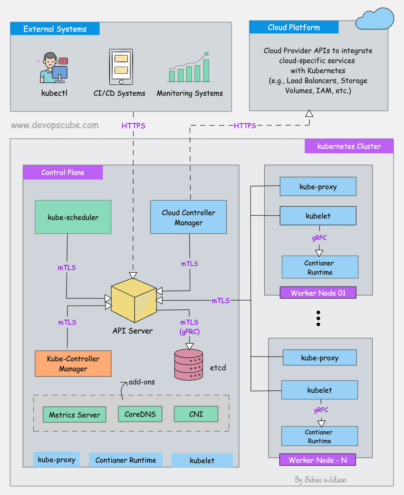

Medium article on CKAD exam certificate :

Medium article on infrastructure of kubernetes components : https://medium.com/@veerababu.narni232/kubernetes-master-components-etcd-api-server-controller-manager-and-scheduler-84b12adfa1b5

-------THESE ALL LINKS OF ARTICLES AND VIDEOS TO DESCRIBE THE COMPONENTS.INFRASTRUCTURE OF KUBERNETES --------------------------------
https://medium.com/@veerababu.narni232/kubernetes-master-components-etcd-api-server-controller-manager-and-scheduler-84b12adfa1b5

https://intellipaat.com/blog/kubernetes-architecture/

https://kodekloud.com/blog/what-is-kubernetes/

https://aws.plainenglish.io/understanding-kubernetes-architecture-a-visual-guide-f63c1f6b0397

https://www.civo.com/academy/kubernetes-concepts/kubernetes-architecture

https://www.civo.com/academy/kubernetes-concepts/kubernetes-architecture

https://www.civo.com/academy/kubernetes-concepts/kubernetes-architecture